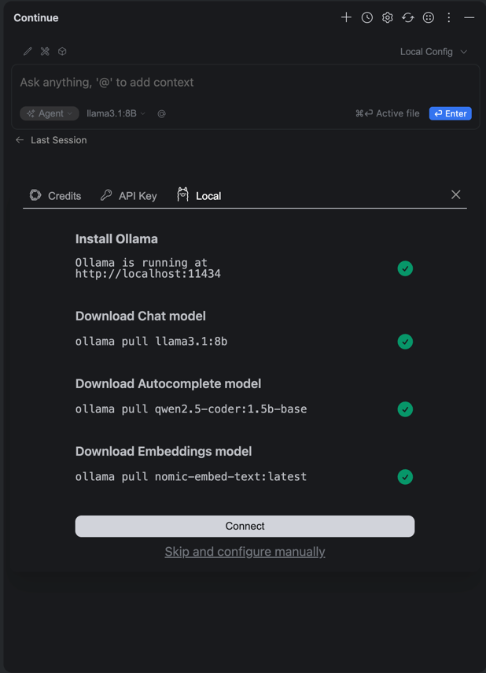

[Back to table of contents](../index.md)

# 🌊 Epilogue: Vibe Coding Cheat Sheet

## 🚀 What We Covered in the Course

1. Understood that LLM ≠ scary magic.
2. Learned to read model names (instruct, quant, coder, etc.).
3. Installed Ollama and ran the first model locally.
4. Connected Continue to IntelliJ IDEA.
5. Used LLM as a full-fledged "copilot":
   - code completion,
   - refactoring,
   - test generation,
   - code explanation.

---

## 🖥 Which Models to Run on Laptops

| Configuration | Suitable Models |
|--------------|-----------------|
| 16 GB RAM, no discrete GPU | Gemma 3:4B, Mistral 7B (q4) |
| 16–32 GB RAM, GPU 6–8 GB | Qwen2.5-coder:7B, DeepSeek R1:8B, Llama 3.1 8B |
| 32–64 GB RAM, GPU ≥12 GB | Qwen2.5 14B, Mistral Medium, DeepSeek R1 14B |
| MacBook Pro M3/M4 | Any models up to 70B (Apple Silicon works with unified memory) |

---

## 🔌 Main Ollama Commands

```bash
# start server
ollama serve

# download model
ollama pull qwen2.5-coder:7b-instruct-q4_K_S

# run model
ollama run qwen2.5-coder:7b-instruct-q4_K_S

# list models
ollama list

# stop model
ollama stop <model>
```

---

## 🛠 IDE Integration (Continue)

1. Open assistant settings in the plugin window and choose:

   

2. In `config.yaml` file insert. Insert your model to config ("TestModel" in my case):
   ```yaml
   name: Local Assistant
   version: 1.0.1
   schema: v1
   models:
     - name: Llama 3.1 8B
       provider: ollama
       model: llama3.1:8b
       roles:
           - chat
           - edit
           - apply
     - name: Qwen2.5-Coder 1.5B
       provider: ollama
       model: qwen2.5-coder:1.5b-base
       roles:
         - autocomplete
     - name: Nomic Embed
       provider: ollama
       model: nomic-embed-text:latest
       roles:
         - embed
     - name: TestModel
       provider: ollama
       model: my_sexy_model:latest
       roles:
         - chat
         - apply
   context:
     - provider: code
     - provider: docs
     - provider: diff
     - provider: terminal
     - provider: problems
     - provider: folder
     - provider: codebase
   ```

3. In model selection window specify `TestModel` (or another model you downloaded via Ollama):

   

### Main Usage Scenarios:

- **Inline Suggestions** → code suggestions.
- **Explain** → explain selected code.
- **Refactor** → improve function or class.
- **Generate tests** → create unit tests.

---

## 📚 Useful Links

- [Ollama](https://ollama.ai/) — installation and models.
- [Continue](https://continue.dev/) — plugin for VSCode and JetBrains IDE.
- [Qwen2.5 Models](https://huggingface.co/collections/Qwen/qwen25-66e81a666513e518adb90d9e) — Alibaba model family.
- [DeepSeek R1](https://huggingface.co/deepseek-ai) — strong models for code.
- [Mistral](https://mistral.ai/) — fast and lightweight models.
- [LM Studio](https://lmstudio.ai/) — Ollama alternative with GUI.

---

## ✨ Vibe Coding Mantra

- "LLM is not scary, it's useful".
- "The best partner is a local Copilot".
- "Vibe coding = less fear, more experiments".

---

## 📌 Conclusion

Now you have a working set of tools for vibe coding.
Try different models, test plugins and build your unique workflow 🚀
Good luck coding with vibe! 🌊

But let's have some more fun before we say goodbye
[Vibe Coder's Oath](pledge.md)
