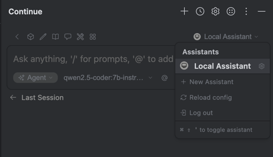
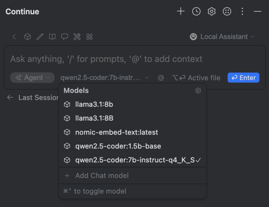

[Назад к оглавлению](../index.md)

# 🌊 Послесловие: Шпаргалка по вайб-кодингу

## 🚀 Что мы прошли в курсе

1. Поняли, что LLM ≠ страшная магия.
2. Научились читать названия моделей (instruct, quant, coder и т.п.).
3. Установили Ollama и запустили первую модель локально.
4. Подключили Continue к IntelliJ IDEA.
5. Использовали LLM как полноценного «копилота»:
   - дописывание кода,
   - рефакторинг,
   - генерация тестов,
   - объяснение чужого кода.

---

## 🖥 Какие модели запускать на ноутбуках

| Конфигурация | Подходящие модели |
|--------------|-------------------|
| 16 GB RAM, без дискретки | Gemma 3:4B, Mistral 7B (q4) |
| 16–32 GB RAM, GPU 6–8 GB | Qwen2.5-coder:7B, DeepSeek R1:8B, Llama 3.1 8B |
| 32–64 GB RAM, GPU ≥12 GB | Qwen2.5 14B, Mistral Medium, DeepSeek R1 14B |
| MacBook Pro M3/M4 | Любые модели до 70B (Apple Silicon умеет работать с унифицированной памятью) |

---

## 🔌 Основные команды Ollama

```bash
# запуск сервера
ollama serve

# загрузка модели
ollama pull qwen2.5-coder:7b-instruct-q4_K_S

# запуск модели
ollama run qwen2.5-coder:7b-instruct-q4_K_S

# список моделей
ollama list

# остановить модель
ollama stop <model>
```

---

## 🛠 Интеграция с IDE (Continue)

1. Открой настройки ассистента в окне плагина и выбери:

   

2. В файле `config.yaml` вставь:
   ```yaml
   - name: llama3.1:8B
     provider: ollama
     model: llama3.1:8b
     roles:
       - chat
       - edit
       - apply
   ```

3. В окне выбора модели укажи `llama3.1:8B` (или другую модель, которую ты скачал через Ollama):

   

### Основные сценарии использования:

- **Inline Suggestions** → подсказки в коде.
- **Explain** → объяснить выделенный код.
- **Refactor** → улучшить функцию или класс.
- **Generate tests** → создать юнит-тесты.

---

## 📚 Полезные ссылки

- [Ollama](https://ollama.ai/) — установка и модели.
- [Continue](https://continue.dev/) — плагин для VSCode и JetBrains IDE.
- [Qwen2.5 Models](https://huggingface.co/collections/Qwen/qwen25-66e81a666513e518adb90d9e) — семейство моделей Alibaba.
- [DeepSeek R1](https://huggingface.co/deepseek-ai) — сильные модели для кода.
- [Mistral](https://mistral.ai/) — быстрые и лёгкие модели.
- [LM Studio](https://lmstudio.ai/) — альтернатива Ollama с графическим интерфейсом.

---

## ✨ Мантра вайб-кодинга

- «LLM — это не страшно, а полезно».
- «Лучший напарник — это локальный Copilot».
- «Вайб-кодинг = меньше страха, больше экспериментов».

---

## 📌 Заключение

Теперь у тебя есть рабочий набор инструментов для вайб-кодинга.
Пробуй разные модели, тестируй плагины и строй свой уникальный поток работы 🚀
Удачи в кодинге с вайбом! 🌊

Но давай повеселимся еще немного, прежде чем мы попрощаемся
[Клятва вайб-кодера](pledge.md)